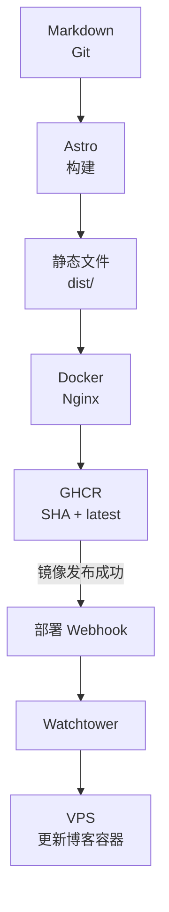

我一直想做一个个人技术博客，却长期没有工期，也不擅长前端。真正开始重建时，最先确认的不是框架，而是文章最终放在哪里。

最初讨论过数据库后台与 Markdown 两条路线。我关心的是以后能否补一个简单的在线编辑器；确认编辑器可以直接生成 Markdown 并提交 Git 后，内容源才定为 Markdown 文件，版本和发布边界交给 Git。

随后确定的约束都很具体：只有一位作者，以中文内容为主，界面要简洁，阅读性能要高，首版不做登录、评论、文章数据库和管理后台。Astro 是这些决定之后的技术选型，不是起点。

最终链路是本地写 Markdown，用 Git 管理草稿和版本，Astro 生成静态站点，再把静态文件装入 Nginx 镜像。本文不复述脚手架命令，而是说明这条链路如何从会话中的选择形成，又怎样被迁移和部署故障反复校正。

## 先定义内容契约

文章首先是一份可以脱离网站独立保存的 Markdown 文档。站点只要求一组最小 Front Matter，用来生成页面和索引：

```yaml
---
title: 文章标题
slug: stable-english-slug
summary: 一句话摘要
publishedAt: 2026-08-19
tags:
  - Astro
aiAssisted: true
cover: null
---
```

Astro Content Collections 在构建时读取这些文件，并通过 schema 检查标题、摘要、日期、标签和 slug。文章路由使用 Front Matter 中的 slug；它只允许小写英文、数字与连字符，因此修改中文标题不会连带改变公开地址。

内容模型里没有 `draft` 字段。草稿放在 `draft/*` 分支，合并到 `master` 才会触发正式构建。这样，Git 已经承担了版本历史、审阅、回退和发布边界，再在文章数据里维护第二套状态只会产生“文件说已发布、分支却未发布”之类的双重事实。

`aiAssisted` 不是生成流程的开关，而是一项随文章保存的公开元数据。当 AI 承担主要执笔工作时，文章列表和详情页显示“AI 辅助创作”。这项披露与正文一起进入 Git，不依赖部署环境。

这套契约刻意没有作者表、分类树、评论关系和正文数据库。单作者博客暂时不需要这些关系；标签足以组织内容，GitHub Issues 可以承接勘误。若未来增加在线编辑器，它也应该通过 GitHub 或 Gitea API 提交同样的 Markdown，而不是成为另一份文章来源。

## Astro 是内容契约的编译器

确定输入以后，框架选型反而简单了。Astro 适合这里，并不是因为它有一套博客模板，而是因为它能把内容集合编译成静态页面，同时保留类型检查和可编程的路由生成。

一次构建会读取所有文章，按发布日期生成首页、归档、标签分页和文章详情，再生成 RSS、sitemap、robots.txt、canonical、Open Graph 与 Twitter Card 元数据。正文使用标准 Markdown，不启用 MDX，也不允许文章携带任意前端组件或浏览器脚本。文章因此仍是普通文本，而不是只能在某个运行时中解释的程序。

Mermaid 也遵循静态优先的原则。作者仍然在 Markdown 中写 fenced code block，但图表在构建阶段借助 Chromium 转成静态 SVG，浏览器不需要下载 Mermaid 运行时再解析一遍。代码高亮同样在构建时完成，并分别生成浅色和深色主题需要的样式。

最终运行镜像里没有 Node.js，也没有读取文章的服务端接口。请求到达时，Nginx 只返回已经生成的 HTML、CSS、SVG 和图片。运行阶段因此没有文章数据库、动态查询或应用服务进程，复杂度主要集中在构建阶段。

静态并不意味着没有交互。主题切换、桌面侧栏收起和代码复制仍需要少量浏览器脚本；移动菜单由原生 `details` 提供。即使增强脚本失效，正文和文章内链接仍是服务端生成的 HTML。

## 界面服务于重复阅读

视觉方向也不是从配色开始的。会话中先生成了编辑出版式、文档式和终端式三种原型，我选择文档式布局：桌面端保留可收起的全局侧栏，文章页增加目录，移动端把导航收进顶部。首页直接进入最新文章，不放营销式 Hero。

这套结构更接近长期使用的技术文档，而不是产品首页。系统字体避免额外字体请求，正文、代码块、表格和 Mermaid 共用排版约束。第一版使用绿色强调色；在实际页面上确认不合适后，才将浅色、深色、代码块、焦点色和图标统一改为石墨灰与琥珀色。

## 发布的是构建产物，不是源码目录

初版已经使用多阶段 Docker 构建和 GHCR，但 Actions 在镜像发布后通过 SSH 登录 VPS 更新容器。后来我明确要求 GitHub 通过 Webhook 推送更新，部署步骤才改为由 Actions 通知 Watchtower，不再向 Actions 提供 VPS SSH 私钥。

当前流程仍由 Node.js 阶段执行 Astro 构建，运行阶段只把 `dist/` 复制到 Nginx。镜像同时获得提交 SHA 对应的不可变标签和用于自动更新的 `latest` 标签：前者提供明确回滚点，后者用于日常更新。



发布顺序很重要。Actions 必须先确认镜像已经推送到 GHCR，再调用 VPS 的更新 Webhook。如果直接把 GitHub 的代码 push 事件转发给服务器，事件可能在镜像仍在构建时到达，Watchtower 即使立即检查也只能看到旧的 `latest`，本次更新就会悄悄落空。

随后又确定博客与 Webhook 必须共用一个宿主机端口，并按路径区分。当前生产 Compose 同时运行博客、Watchtower 和入口代理；代理把普通请求交给博客，只把更新路径交给 Watchtower。

Webhook 凭证分别保存在 Actions Secrets 和 VPS 环境文件中。未来切换 Git 托管平台时，静态镜像和 Compose 结构可以保留，需要替换的是构建触发和镜像仓库。

## 用旧内容检验新模型

空站点能构建成功，只能证明模板可用，不能证明内容模型经得起真实数据。旧 Typecho 博客提供了第一次完整检验：从公开归档中筛选出 16 篇正式或技术文章，转换成 Markdown，并保留原始发布日期、代码块、表格、链接和长文结构。

图片没有继续依赖旧站，而是下载进仓库并生成响应式 WebP，正文补上尺寸与延迟加载。Nginx 为 16 个旧 `/archives/...` 路径配置 301，使它们在请求到达新部署后跳转到稳定 slug。

这组 301 不能改变旧域名的 DNS。只有旧域名仍指向这套 Nginx，或者由旧站代理到新站时，原地址才会继续生效。仓库负责路径兼容，域名切换仍属于部署环境。

迁移真正暴露的是内容兼容问题：Shiki 不认识旧代码块的 `auto` 语言，编码后的中文图片名可能被重复编码，普通 `` 缺少响应式尺寸，命令参数也需要改成行内代码以免排版转换破坏原文。

之后的新文章又暴露了另一条边界：标签 `HTTP/2` 含有路径分隔符。修复没有篡改显示名称，而是在路由层把它规范化为 `http-2`。这些问题说明内容不是页面完成后的填充物，它本身就是集成测试。

## 失败与验证盲区留下的契约

构建过程里最有价值的部分，不是一次成功，而是每次故障最终留下了什么验证规则。

| 事件                   | 事实与留下的契约                                                                                                                                                                                     |
| ---------------------- | ---------------------------------------------------------------------------------------------------------------------------------------------------------------------------------------------------- |
| 可选 Webhook 没有配置  | **事实：** 镜像已经推送，通知步骤却因缺少配置让整个 Workflow 失败。<br>**修正：** 缺少 Webhook 配置时告警并跳过通知。<br>**契约：** 镜像发布和 VPS 自动更新必须是两个独立结果。                      |
| 干净 VPS 目录启动失败  | **事实：** Compose 挂载了目录中不存在的 Nginx 文件，Docker 无法把它挂到容器文件路径。<br>**修正：** 把代理配置内嵌进 Compose，并将生产部署收敛为单文件。<br>**契约：** 必须在干净目录复现首次部署。  |
| 宿主机端口无法绑定     | **事实：** 目标端口已经被其他服务占用，本地空闲端口测试没有覆盖 VPS 状态。<br>**修正：** 先检查占用，再通过环境变量选择端口。<br>**契约：** 本地容器成功不能证明服务器端口可用。                     |
| 入口代理反复重启       | **事实：** Nginx 启动时无法解析尚未就绪的 Watchtower 服务名。<br>**修正：** 使用 Docker DNS 和请求时解析的上游变量。<br>**契约：** 检查容器重启日志，并验证上游暂不可解析时代理仍能启动。            |
| 删除文章后仍引用旧内容 | **事实：** Astro 生成缓存保留了已删除的集合项。<br>**修正：** 移开生成缓存后从零构建。<br>**契约：** 删除内容后检查文章路由、标签、RSS 与 sitemap，不只看编译结果。                                  |
| 通知步骤显示绿色       | **事实：** 绿色只证明 Webhook 请求没有网络错误或 HTTP 4xx/5xx；当时线上更新最终成功，但这是随后实测得出的。<br>**契约：** 再检查一篇迁移文章、归档中的 16 篇计数和一个旧路径 301，才能确认生产更新。 |

这些记录划清了“站点构建成功”“镜像发布成功”“通知被接受”和“生产容器已更新”四个状态。它们属于同一条流水线，却不是同一个事实。那次绿色通知最终对应成功上线，但结论来自后续 HTTP 检查，而不是绿色图标本身。

## AI 提高速度，证据决定完成

AI 参与了需求整理、三套视觉原型、Astro 实现、旧文转换、部署排障和浏览器检查。由我确认单作者边界、生产分支、文档式布局、迁移范围和共享端口等选择，再由 AI 把这些约束转成代码与文档。

会话也记录了 AI 验证不足的地方：早期测试覆盖了理想环境，却漏掉干净部署目录、宿主机端口和容器 DNS 时序。在我要求实际复现后，验证才扩展到干净目录、容器日志、授权请求和线上 HTTP 行为。

因此，AI 辅助并不等于把判断交给模型。会话确认意图，提交差异证明改了什么，构建结果证明产物成立，浏览器和线上请求证明用户真正得到什么。只有这些证据能决定工作是否完成。

## 让系统围绕文章生长

回头看，Tursom Log 的关键设计并不是 Astro、Docker 或某一种配色，而是始终只有一份文章事实。Markdown 保存正文和公开元数据，Git 保存历史与发布边界，其他组件都只是从这份事实生成索引、页面和运行产物。

这让很多“不做”的决定变得自然：不做数据库，不做常驻应用，不做平行的草稿状态，不让在线编辑器拥有独立存储，也不把线上容器当作内容源。系统减少的每一份状态，都是以后少一次同步、备份、权限配置和故障恢复。

一个个人博客不需要复刻大型内容平台。它需要的是在几年后仍能打开仓库，看懂文章在哪里、如何构建、怎样发布，以及出现问题时用什么证据判断。先决定文章放在哪里，剩下的架构才有机会保持简单。
