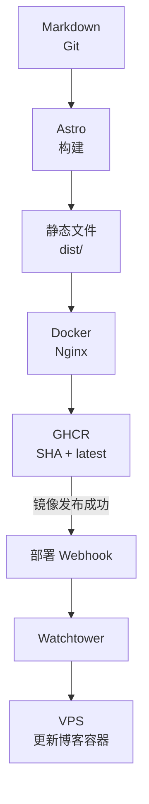

我一直想做个个人技术博客，但一直没空，前端也不熟。真正动手重建的时候，我最先确认的不是用什么框架，而是文章最后放在哪。

当时讨论过两条路：数据库后台，或者直接用 Markdown。我比较在意以后能不能加一个简单的在线编辑器。确认编辑器可以直接生成 Markdown 并提交 Git 之后，内容源就定成 Markdown 文件，版本和发布都交给 Git。

其余约束也很具体：只有我一个作者，以中文为主，界面要干净，打开要快。第一版不做登录、评论、文章数据库和管理后台。Astro 是这些定完之后才选的。

## Front Matter 很少，草稿也不放进文件里

文章对我来说首先是一份能脱离网站单独保存的 Markdown。站点只需要一组很小的 Front Matter：

```yaml
---
title: 文章标题
slug: stable-english-slug
summary: 一句话摘要
publishedAt: 2026-08-19
tags:
  - Astro
aiAssisted: true
cover: null
---
```

Astro Content Collections 在构建时读这些文件，用 schema 检查标题、摘要、日期、标签和 slug。文章地址用 Front Matter 里的 slug，只允许小写英文、数字和连字符，改中文标题不会把公开地址一起改掉。

没有 `draft` 字段。草稿放在 `draft/*` 分支，合并到 `master` 才触发正式构建。Git 已经能管版本历史、审阅、回退和发布，再在文章数据里维护一套状态，很容易出现“文件说已发布、分支却还没合”。

`aiAssisted` 也只是跟着文章保存的公开标记。AI 承担主要执笔时，列表和详情页会显示“AI 辅助创作”。这个信息和正文一起进 Git。

作者表、分类树、评论、正文数据库都没有。一个人的博客暂时用不上；标签够用来组织内容，勘误丢 GitHub Issues。以后如果做在线编辑器，也应该通过 GitHub 或 Gitea API 提交同样的 Markdown，而不是再养一份文章来源。

## Astro、文档式界面、静态构建

输入定了，框架反而好选。Astro 能把内容集合编译成静态页面，还有类型检查，路由也能自己写。一次构建会读全部文章，生成首页、归档、标签分页、详情页，再生成 RSS、sitemap、robots.txt，以及 canonical、Open Graph、Twitter Card。

正文用标准 Markdown，不用 MDX，文章里也不能夹任意前端组件或浏览器脚本。Mermaid 仍然写 fenced code block，但图表在构建阶段用 Chromium 转成静态 SVG。代码高亮同样在构建时做完，浅色和深色各出一套样式。

运行镜像里没有 Node.js，也没有读文章的接口。Nginx 只返回已经生成好的 HTML、CSS、SVG 和图片。主题切换、侧栏收起、代码复制还是要一点点浏览器脚本；移动菜单用原生 `details`。脚本挂了，正文和文内链接还在。

界面也不是从配色开始的。当时让 AI 做了编辑出版式、文档式、终端式三套原型，我选了文档式：桌面端留一个可收起的全局侧栏，文章页加目录，移动端把导航收进顶部。首页直接进最新文章。第一版用过绿色强调色，实际页面上看着不对，后来才改成石墨灰和琥珀色。

## 旧博客迁过来

空站点能构建成功，只说明模板能跑。旧 Typecho 博客才是第一次完整检验：从公开归档里筛了 16 篇正式或技术文章，转成 Markdown，原始发布日期、代码块、表格、链接和长文结构都留着。

图片没有继续挂旧站，下进仓库并生成响应式 WebP。Nginx 给 16 个旧 `/archives/...` 路径配了 301。这组 301 改不了旧域名的 DNS——只有旧域名还指着这套 Nginx，或者旧站把请求代理过来，原地址才会继续有效。

迁移碰到的都是内容兼容：Shiki 不认旧代码块的 `auto` 语言，编码过的中文图片名可能被再编码一遍，普通 `` 缺响应式尺寸，命令参数也得改成行内代码，不然排版一转就把原文弄坏。后来写新文章又踩到标签 `HTTP/2` 里有路径分隔符，显示名没改，只在路由层规范化成 `http-2`。

删文章也踩过：Astro 生成缓存还留着已删除的集合项，移开缓存从零构建之后才干净。后来删除内容都会再看一遍文章路由、标签、RSS 和 sitemap，不只看编译过没过。

## 发布后来改成了 Webhook

初版已经用多阶段 Docker 构建和 GHCR，但 Actions 推完镜像后还要 SSH 登录 VPS 更新容器。后来我明确要求 GitHub 只通过 Webhook 推更新，才改成 Actions 通知 Watchtower，不再把 VPS SSH 私钥交给 Actions。

现在还是 Node.js 阶段跑 Astro 构建，运行阶段只把 `dist/` 拷进 Nginx。镜像同时打提交 SHA 的不可变标签，以及用来自动更新的 `latest`。



发布顺序是后来才想清楚的。有一次如果把 GitHub 的代码 push 事件直接转给服务器，事件会在镜像还在构建时就到。Watchtower 立刻去查，看到的还是旧的 `latest`，更新就悄悄没了。所以 Actions 必须先确认镜像已经到 GHCR，再调 Webhook。

后来还确定博客和 Webhook 共用一个宿主机端口，按路径区分。生产 Compose 同时跑博客、Watchtower 和入口代理。凭证分别放在 Actions Secrets 和 VPS 环境文件里。以后换 Git 托管平台，静态镜像和 Compose 可以留着，要换的是构建触发和镜像仓库。

## 部署踩过几脚

可选 Webhook 没配的时候，镜像已经推上去了，通知步骤却把整个 Workflow 弄失败。后来改成缺配置就告警并跳过通知——镜像发布和 VPS 自动更新是两件事。

干净 VPS 目录启动失败过：Compose 挂载了目录里不存在的 Nginx 文件，Docker 没法把它挂到容器路径。后来把代理配置内嵌进 Compose，生产部署收成单文件，首次部署也改成在干净目录复现。

本地端口空着，VPS 上目标端口已经被别的服务占了。本地容器成功不能证明服务器端口可用，后来改成先检查占用，再用环境变量选端口。

入口代理还反复重启过：Nginx 启动时解析不了尚未就绪的 Watchtower 服务名。改成 Docker DNS、请求时再解析上游之后，上游暂时不可解析也能启动。

通知步骤显示绿色，也只能说明 Webhook 请求没有网络错误或 HTTP 4xx/5xx。那次线上最后确实更新成功了，但结论来自后面的 HTTP 检查：一篇迁移文章、归档里 16 篇的计数、一个旧路径 301。绿色图标本身说明不了生产容器已经换了。

## AI 写得快，验收还得自己盯

AI 参与了需求整理、三套视觉原型、Astro 实现、旧文转换、部署排障和浏览器检查。单作者边界、生产分支、文档式布局、迁移范围、共享端口这些是我定的。

早期测试覆盖了理想环境，却漏了干净部署目录、宿主机端口和容器 DNS 时序。我要求实际复现之后，验证才扩到干净目录、容器日志、授权请求和线上 HTTP。

会话确认我想做什么，提交差异证明改了什么，构建结果证明产物能出来，浏览器和线上请求证明用户真能看到。只有这些能说明事情做完了。Astro、Docker 和配色都可以换；文章仍然只有一份，放在仓库的 Markdown 里。
