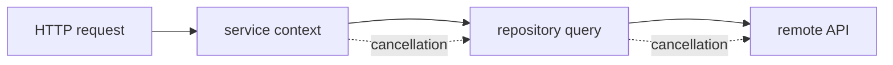

一次请求超时之后，真正需要处理的不是一个错误返回值，而是一整条调用链上的资源和状态。`context.Context` 提供了传播取消信号的标准方式，但它并不会替我们完成清理。

## 取消信号如何传播

父 context 被取消时，所有派生 context 都会收到 `Done` 信号。长时间运行的函数需要主动监听这个信号，并把它传递给下一层 I/O 或后台任务。

```go
func loadProfile(ctx context.Context, id string) (Profile, error) {
    request, err := http.NewRequestWithContext(ctx, http.MethodGet, endpoint(id), nil)
    if err != nil {
        return Profile{}, err
    }

    response, err := http.DefaultClient.Do(request)
    if err != nil {
        return Profile{}, err
    }
    defer response.Body.Close()

    return decodeProfile(response.Body)
}
```

## 一条调用链的检查点



这里有两个容易被忽略的边界：已经提交给外部系统的动作不一定能被撤回；而本地锁、临时文件和 goroutine 则必须有明确的释放路径。

## 实践结论

取消处理应该和业务动作一起设计。为每一个可能阻塞的边界传递 context，在超时和取消路径上验证资源是否释放，再决定是否需要独立的补偿任务。
