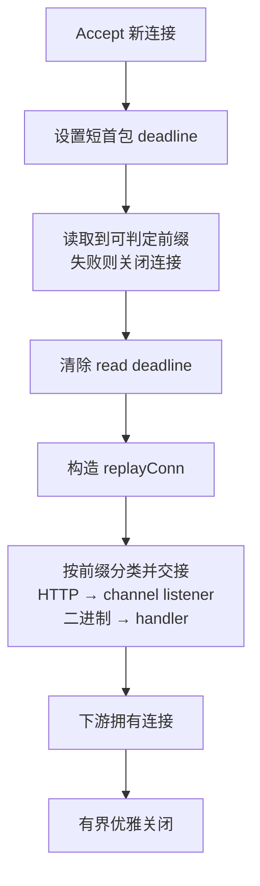

生产上碰到过几次，一个端口要同时接好几种流量：gRPC 和 `/metrics` 共用，或者 HTTP 再加一条自定义二进制长连接。下面这些实现都来自实际跑过的 Go 服务，项目和业务信息隐去。

先说容易混在一起的几件事。TCP 和 UDP 写成同一个数字，根本不是同一个 listener，那只是端口号碰巧一样。`/healthz`、`/metrics` 和管理 API 也不是新协议，只是同一个 HTTP 服务里的不同路由。WebSocket 先以普通 HTTP/1.1 `GET` 进来，`Upgrade` 之后才切成双向消息流，首包分类器眼里它还是 HTTP。KCP、QUIC 如果各自建 listener，也不算同一个 TCP 口上的复用。

真正要选的是分流发生在哪一层。gRPC 和普通 HTTP 本来就共享 HTTP 语义，可以在请求上拆；协议完全不同，就只能看连接开头那批字节。选得越靠下，越接近原始字节流，超时、回放、背压和关闭也越得自己扛。

## 最先想到的是 cmux

[`cmux`](https://github.com/soheilhy/cmux/tree/v0.1.5) 接受一个真实 `net.Listener`，读新连接的开头，按注册顺序跑 matcher，再把连接交给对应的虚拟 listener。上层的 `grpc.Server` 和 `http.Server` 仍然调用熟悉的 `Serve(net.Listener)`。gRPC 和 HTTP/1 运维端点共享端口时，最小结构大概是这样：

```go
root, err := net.Listen("tcp", addr)
if err != nil {
    return err
}

mux := cmux.New(root)
mux.SetReadTimeout(2 * time.Second)

grpcListener := mux.MatchWithWriters(
    cmux.HTTP2MatchHeaderFieldPrefixSendSettings(
        "content-type",
        "application/grpc",
    ),
)
httpListener := mux.Match(cmux.HTTP1Fast())

go grpcServer.Serve(grpcListener)
go httpServer.Serve(httpListener)
return mux.Serve()
```

短示例容易盖住几个细节。`cmux.Match` 的注册顺序就是匹配顺序，更具体的协议放前面，兜底放最后；先注册 `cmux.Any()`，后面的规则永远不会跑。matcher 读过的数据也不会凭空消失——`cmux` 用带缓冲的连接包一层，下游会先读到刚才窥探过的字节，再继续读底层连接。

gRPC 客户端还可能在发完完整请求头之前，先等服务端 HTTP/2 `SETTINGS` frame。`MatchWithWriters` 允许 matcher 在识别期间先写出设置帧。会写连接的 matcher 会影响真正协议服务器接手前的线级状态，只在明确需要时用。

Content-Type 也不是只有精确的 `application/grpc`。官方 [gRPC over HTTP/2 协议](https://github.com/grpc/grpc/blob/master/doc/PROTOCOL-HTTP2.md) 允许 `application/grpc+proto`、`application/grpc+json` 以及自定义后缀。用精确值 matcher 会把合法变体拒掉，通用实现应该匹配前缀。

然后是 `cmux` 自己也写在限制里的那条：分类单位是连接，不是 HTTP/2 stream。第一条请求是 gRPC，整条连接就交给 `grpc.Server`，后面再来普通 HTTP/2 也不会重新匹配。所以它适合客户端用途稳定的场景——gRPC 客户端只发 gRPC，Prometheus 只用 HTTP/1。通用 HTTP/2 client 想在同一连接里交替访问两种 API，这条路走不通。

`cmux.HTTP1Fast()` 也只是乐观地匹配常见 HTTP 方法前缀。v0.1.5 里 `PATCH` 和自定义方法要自己补。对 `GET /metrics` 通常够用，对公开 HTTP API 就得评估更严的 matcher。

还有超时。`http.Server.ReadHeaderTimeout` 只在连接已经交给 HTTP server 后生效，保护不了堵在 matcher 里的连接。`cmux` 默认不设匹配读取超时，上面那段 `SetReadTimeout(2 * time.Second)` 不是可选项。客户端建连但不发够字节，就能一直占着 socket 和 goroutine。

## gRPC 和 HTTP 其实可以不拆连接

两种流量本来都属于 HTTP 时，通常不必在 `net.Conn` 层拆成两个 listener。gRPC 请求也是 HTTP/2 请求，只是 Content-Type 和 framing 比较特殊。让同一个 `http.Server` 先解析完，再按请求交给不同 handler：

```go
root := http.HandlerFunc(func(w http.ResponseWriter, r *http.Request) {
    contentType := strings.ToLower(r.Header.Get("Content-Type"))
    isGRPC := r.ProtoMajor == 2 &&
        strings.HasPrefix(contentType, "application/grpc")

    if isGRPC {
        grpcServer.ServeHTTP(w, r)
        return
    }
    httpHandler.ServeHTTP(w, r)
})

protocols := new(http.Protocols)
protocols.SetHTTP1(true)
protocols.SetUnencryptedHTTP2(true)

server := &http.Server{
    Handler:           root,
    Protocols:         protocols,
    ReadHeaderTimeout: 5 * time.Second,
}
return server.Serve(listener)
```

这和 cmux 差在判断发生在 `ServeHTTP`，每个请求都会重新走一次。**同一条 HTTP/2 连接的不同 stream 可以分别进 gRPC 和普通 HTTP**，不会被第一个请求锁死。

现代 Go 的 [`http.Server.Protocols`](https://pkg.go.dev/net/http#Protocols) 可以直接启用 HTTP/1 与明文 HTTP/2。这里的明文 HTTP/2 指客户端直接发送 HTTP/2 connection preface，也就是 prior knowledge。标准库不会处理先发 HTTP/1.1、再 `Upgrade: h2c` 的握手。

较旧的写法是 [`h2c.NewHandler`](https://pkg.go.dev/golang.org/x/net/http2/h2c)，它两种都能认：

```go
server := &http.Server{
    Handler: h2c.NewHandler(root, &http2.Server{}),
}
```

这段还能解释大量存量服务，但不该再无条件复制。当前 `x/net/http2/h2c` 已标记 deprecated；新服务如果能约束客户端用 prior knowledge，优先用标准库的 `Protocols`。现有客户端依赖 HTTP/1.1 upgrade 的，不能没做兼容性验证就换。旧 wrapper 会先把 h2c 连接的首个请求完整读进内存，外层要加 `http.MaxBytesHandler`。

[`grpc.Server.ServeHTTP`](https://pkg.go.dev/google.golang.org/grpc#Server.ServeHTTP) 目前仍标 Experimental。它用的是 Go 标准库的 HTTP/2 server，和 `grpc.Server.Serve` 用的 grpc-go HTTP/2 server 是两套实现，支持和性能可能不同。实际用到的 gRPC 功能和负载要自己测过，不能把两种入口当成无条件等价。

入口如果用 TLS，终止后再走同样的 handler 路由即可。`net/http` 通过 ALPN 接入 HTTP/2。分流器如果在 TLS 终止之前，只能看到 ClientHello，按 HTTP path 或 Content-Type 区分不了内部协议，最多按 SNI 或 ALPN 拆，或者把判断移到终止 TLS 的组件后面。

## HTTP 和二进制协议只能看首包

两种协议没有共同的请求层时，比如明文 HTTP 和自定义二进制长连接，就得直接看连接开头的字节。实用约束可以很窄：HTTP 分支必须以已知方法名和空格开头，二进制协议的合法握手不会产生这些前缀。识别出 HTTP 之后，仍然交给标准库 `http.Server`，不要自己实现请求解析、keep-alive 和 upgrade。

```go
func routeConn(conn net.Conn, web *chanListener) {
    if err := conn.SetReadDeadline(time.Now().Add(time.Second)); err != nil {
        conn.Close()
        return
    }

    peeked, err := readUntilDecidable(conn)
    if err != nil {
        conn.Close()
        return
    }
    if err := conn.SetReadDeadline(time.Time{}); err != nil {
        conn.Close()
        return
    }

    replayed := &replayConn{
        Conn: conn,
        r:    io.MultiReader(bytes.NewReader(peeked), conn),
    }

    if looksLikeHTTP(peeked) {
        if !web.Deliver(replayed) {
            conn.Close()
        }
        return
    }
    binaryHandler(replayed)
}
```

TCP 不保留 `Write` 的边界。第一次 `Read` 可能只得到 `G` 或 `GE`，不能因为它还不是完整的 `GET ` 就判成二进制。分类器要同时看两件事：当前字节是否已经完整匹配某个 HTTP 方法前缀，以及是否仍可能发展成某个前缀。完整匹配才进 HTTP，明确不可能才进二进制；还可能就继续读，直到达到最长方法前缀、连接出错或首包 deadline 到期。读取上限由协议签名长度决定，不要无限等请求头。

开头那批字节已经被取走，下游如果直接读原连接，会从握手中间开始。`io.MultiReader(bytes.NewReader(peeked), conn)` 把内存里的前缀拼回去，业务 handler 不用知道连接被窥探过。包装 `net.Conn` 时还要注意 `CloseWrite` 这类可选能力——长连接 relay 常用它做 TCP half-close，wrapper 没转发的话，下游类型断言失败，只能关掉整条连接。

HTTP 分支我用过一个由 channel 驱动的虚拟 listener：主 accept 循环把已经回放的连接投进去，`http.Server.Serve` 像用普通 listener 一样从 `Accept` 拿。channel 要有容量和关闭语义。投递满时不能卡住所有分类 goroutine，也不能把已经识别为 HTTP 的连接降级给二进制 handler；通常是记一条低基数指标，然后关掉。分类错误和容量不足是两回事，混在 fallback 里会很难排。



测这类分类器时，至少要覆盖方法被拆成多次 `Read`（先 `GE` 再 `T `）、恰好以 `GET ` 开头的二进制前缀、回放连接先吐已窥探字节、以及 wrapper 还保不保 `CloseWrite`。空连接和首包超时也要单独看。

## 实际怎么选，以及关的时候谁管这条连接

两种流量都能先被解析成 HTTP 请求，就走请求级。不行的话，看有没有稳定、互斥、长度有界的连接签名——有就可以用 cmux。必须自己嗅探时，歧义、超时、回放、背压和关闭得能分别写成测试；写不出来就拆端口，或者把协议识别交给专用代理。

端口很少是最贵的资源。为了少开一个口去猜协议，通常不划算。单端口更有价值的场景是部署环境只允许一个入口、客户端端口配不了，或者运维探针和 RPC 想共用现有网络策略。

生产问题大多不在 matcher 那十几行里。每个虚拟 listener 都有队列，下游不消费或已经关闭时，分类层必须把连接结束掉并暴露原因。只把 server 错误写进一个没人听的 channel，根 accept 循环还会继续跑。更稳的是让根 listener、分类循环和各协议 server 进同一个错误组，非预期错误就取消、关掉根 listener，再等其他组件退出。正常关闭和真实故障要分开，不然发版期间告警会很吵。

关闭顺序后来是这样排的：先把 readiness 切成不接流量；关根 listener，停止接受和分类；关虚拟 listener，解开阻塞中的 `Accept`；HTTP 走带 deadline 的 `Shutdown`；gRPC 或二进制会话做有上限的 graceful drain，超时强制关；最后等还在分类的 goroutine 交接或退出。指不出每条连接在每个阶段由谁关掉，生命周期就还没设计完。`sync.Once` 只能保证退出路径幂等，替代不了有界等待。

## 参考资料

- [cmux v0.1.5 README 与限制](https://github.com/soheilhy/cmux/tree/v0.1.5)
- [cmux v0.1.5 matcher 实现](https://github.com/soheilhy/cmux/blob/v0.1.5/matchers.go)
- [gRPC over HTTP/2 Protocol](https://github.com/grpc/grpc/blob/master/doc/PROTOCOL-HTTP2.md)
- [Go net/http Protocols](https://pkg.go.dev/net/http#Protocols)
- [golang.org/x/net/http2/h2c](https://pkg.go.dev/golang.org/x/net/http2/h2c)
- [grpc-go Server.ServeHTTP](https://pkg.go.dev/google.golang.org/grpc#Server.ServeHTTP)
