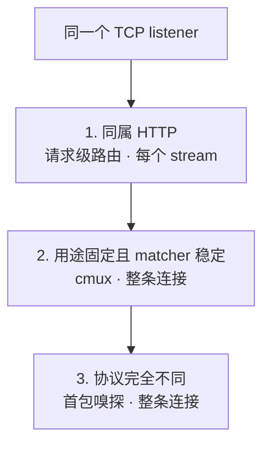
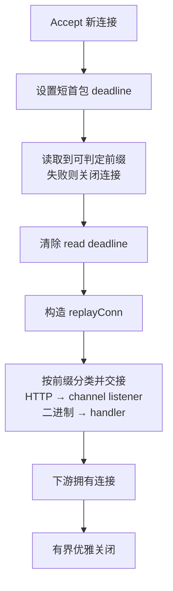

“让一个端口同时提供多种协议”听起来像一个具体需求，实际至少包含三类完全不同的问题：多个传输是否只是使用了相同的端口号，多个应用协议是否共享同一个监听器，以及多个请求是否还能共享同一条已建立的连接。

这三类问题的实现成本和故障边界相差很大。gRPC 与普通 HTTP 本来就共享 HTTP 语义，可以在请求层路由；HTTP 与自定义二进制协议没有共同的请求模型，只能在连接建立后检查首批字节；TCP 与 UDP 即使都写成同一个数字，也根本不是同一个监听器。

本文从多个生产 Go 服务中提炼出三种经过实践的模式，并将项目和业务信息全部隐去。重点不在于复制一段“端口复用代码”，而是确定**分流决策应该发生在哪一层，以及做出决策后谁拥有连接的完整生命周期**。

## 先澄清“同一个端口”

讨论实现前，先区分三个经常被混用的概念。

| 概念              | 实际含义                                                       | 是否属于本文的协议复用   |
| ----------------- | -------------------------------------------------------------- | ------------------------ |
| 相同端口号        | TCP 与 UDP 使用相同数字时，仍属于不同传输命名空间              | 否，只是数字相同         |
| 同一 TCP listener | 所有连接都来自同一个 `net.Listener.Accept`，再按连接内容分流   | 是，属于连接级复用       |
| 同一 HTTP/2 连接  | 一条 TCP 连接中存在多个并发 stream，每个 stream 都有独立请求头 | 是，但应优先在请求级分流 |

HTTP 路径也不是新协议。`/healthz`、`/metrics` 和管理 API 只是同一个 HTTP 服务里的不同路由。WebSocket 同样不是首包分类器眼中的第三种协议：它先以普通 HTTP/1.1 `GET` 请求进入 HTTP 服务，完成 `Upgrade` 后才切换为双向消息流。

KCP、QUIC 等基于 UDP 的入口如果分别创建自己的 listener，也不属于同一个 TCP listener 上的复用。HAProxy PROXY Protocol 若只在连接上游时写出，则更不是入口协议。先把这些边界说清楚，才能避免用一个模糊的“多协议”覆盖数种不相干的网络结构。



图中三条路径不是需要同时叠加的组件，而是三种分流层级。选得越靠下，越接近原始字节流，获得的自由越多，需要自己承担的超时、回放、背压和关闭责任也越多。

## 连接级分流：用 cmux 派生虚拟 listener

[`cmux`](https://github.com/soheilhy/cmux/tree/v0.1.5) 接受一个真实 `net.Listener`，读取新连接的开头部分，按注册顺序运行 matcher，再把连接投递给对应的虚拟 listener。上层的 `grpc.Server` 和 `http.Server` 仍然调用熟悉的 `Serve(net.Listener)`，不需要知道底层端口正在复用。

下面是适合 gRPC 与 HTTP/1 运维端点共享端口的最小结构：

```go
root, err := net.Listen("tcp", addr)
if err != nil {
    return err
}

mux := cmux.New(root)
mux.SetReadTimeout(2 * time.Second)

grpcListener := mux.MatchWithWriters(
    cmux.HTTP2MatchHeaderFieldPrefixSendSettings(
        "content-type",
        "application/grpc",
    ),
)
httpListener := mux.Match(cmux.HTTP1Fast())

go grpcServer.Serve(grpcListener)
go httpServer.Serve(httpListener)
return mux.Serve()
```

这里有四个容易被短示例掩盖的细节。

第一，**matcher 有优先级**。`cmux.Match` 的注册顺序就是匹配顺序，更具体的协议应该放在前面，兜底 matcher 必须放在最后。若先注册 `cmux.Any()`，后面的规则永远不会运行。

第二，matcher 读取的数据不会凭空消失。`cmux` 用带缓冲的连接包装原始 `net.Conn`，匹配完成后，下游会先读到窥探过的字节，再继续读取底层连接。这种“先看、再完整回放”的语义是所有首包分流器的核心。

第三，gRPC 客户端可能在发送完整请求头前等待服务端 HTTP/2 `SETTINGS` frame。`MatchWithWriters` 允许 matcher 在识别期间先写出设置帧，解决这类握手相互等待。写连接的 matcher 会影响真正协议服务器接手前的线级状态，所以只应在明确需要时使用。

第四，gRPC 的 Content-Type 不是只有精确的 `application/grpc`。官方 [gRPC over HTTP/2 协议](https://github.com/grpc/grpc/blob/master/doc/PROTOCOL-HTTP2.md) 允许 `application/grpc+proto`、`application/grpc+json` 以及自定义后缀。用精确值 matcher 会拒绝合法变体，因此通用实现应该匹配 `application/grpc` 前缀；若客户端集合受控，也必须把精确匹配写成显式兼容约束。

### 连接一旦分类，就不能反悔

`cmux` 的分类单位是连接，不是 HTTP/2 stream。假设一条 HTTP/2 连接的第一个请求是 gRPC，它会整体交给 `grpc.Server`；随后即使同一连接出现普通 HTTP/2 请求，也不会重新经过 matcher。`cmux` 自己也把“同一连接不能混用 REST 与 gRPC”列为限制。

因此，这种方案适合客户端连接用途稳定的场景：gRPC 客户端只发送 gRPC，Prometheus 或探针只使用 HTTP/1。它不适合让一个通用 HTTP/2 client 在同一连接中交替访问 gRPC 与普通 HTTP API。

`cmux.HTTP1Fast()` 也只是乐观地匹配常见 HTTP 方法前缀，不等于验证出一个合法 HTTP 请求。在 v0.1.5 中，自定义方法以及 `PATCH` 等未包含的方法需要显式补充。对只有 `GET /metrics` 的窄入口这通常足够，对公开 HTTP API 则应评估更严格的 matcher。

## 请求级分流：让 HTTP server 统一接入

当待复用的两种流量本来都属于 HTTP，通常不必在 `net.Conn` 层拆成两个 listener。gRPC 请求也是 HTTP/2 请求，只是具有特定的 Content-Type 和 framing。让同一个 `http.Server` 先完成 HTTP/1、HTTP/2 或 h2c 解析，再把每个请求交给不同 handler，分流边界会清晰得多。

```go
root := http.HandlerFunc(func(w http.ResponseWriter, r *http.Request) {
    contentType := strings.ToLower(r.Header.Get("Content-Type"))
    isGRPC := r.ProtoMajor == 2 &&
        strings.HasPrefix(contentType, "application/grpc")

    if isGRPC {
        grpcServer.ServeHTTP(w, r)
        return
    }
    httpHandler.ServeHTTP(w, r)
})

protocols := new(http.Protocols)
protocols.SetHTTP1(true)
protocols.SetUnencryptedHTTP2(true)

server := &http.Server{
    Handler:           root,
    Protocols:         protocols,
    ReadHeaderTimeout: 5 * time.Second,
}
return server.Serve(listener)
```

现代 Go 的 [`http.Server.Protocols`](https://pkg.go.dev/net/http#Protocols) 可以直接启用 HTTP/1 与明文 HTTP/2。这里的明文 HTTP/2 指客户端直接发送 HTTP/2 connection preface，也就是 prior knowledge；标准库不会处理先发 HTTP/1.1 请求、再通过 `Upgrade: h2c` 切换协议的握手。

较旧的 Go 版本通常使用 [`h2c.NewHandler`](https://pkg.go.dev/golang.org/x/net/http2/h2c) 包装根 handler，它同时识别 prior knowledge 和 HTTP/1.1 upgrade：

```go
server := &http.Server{
    Handler: h2c.NewHandler(root, &http2.Server{}),
}
```

这段旧写法仍能解释大量存量服务，但不应该再被无条件复制。当前 `x/net/http2/h2c` 已标记为 deprecated；新服务若能约束客户端使用 prior knowledge，应优先使用标准库的 `Protocols`。若现有客户端依赖 HTTP/1.1 upgrade，则不能在没有兼容性验证的情况下直接替换。旧 wrapper 会先把 h2c 连接的首个请求完整读入内存，使用时应在外层加 `http.MaxBytesHandler` 限制请求大小。

请求级路由还有一个 grpc-go 特有的约束：[`grpc.Server.ServeHTTP`](https://pkg.go.dev/google.golang.org/grpc#Server.ServeHTTP) 目前仍标为 Experimental。它使用 Go 标准库的 HTTP/2 server，与 `grpc.Server.Serve` 使用的 grpc-go HTTP/2 server 是两套独立实现，支持的功能和性能可能不同。选择这条路径前应针对实际使用的 gRPC 功能和负载做兼容性、性能测试，不能把两种入口视为无条件等价。

请求级分流有一个连接级 mux 不具备的性质：**同一条 HTTP/2 连接的不同 stream 可以分别进入 gRPC handler 和普通 HTTP handler**。判断发生在 `ServeHTTP`，每个请求都会重新执行一次，而不是由首个请求永久决定连接归属。

若入口使用 TLS，TLS 终止后仍可采用同样的 handler 路由。`net/http` 通过 ALPN 接入 HTTP/2，并为 handler 提供已解密请求。反过来，若分流器位于 TLS 终止之前，它只能看到 ClientHello，不能根据 HTTP path 或 Content-Type 区分内部协议；此时最多按 SNI 或 ALPN 分流，或者把更细的判断移到终止 TLS 的组件之后。

## 自定义首包嗅探：分流 HTTP 与二进制协议

如果两种协议没有共同的请求层，例如明文 HTTP 与自定义二进制长连接，就需要直接检查连接开头的字节。一种实用约束是：HTTP 分支必须以已知方法名和空格开头，而二进制协议的合法握手不会产生这些前缀。

这不是“解析 HTTP”，只是使用一个足够窄的、可以测试的判定规则。识别出 HTTP 后仍应把连接交给标准库 `http.Server`，而不是自行实现请求解析、keep-alive、upgrade 和异常报文处理。

```go
func routeConn(conn net.Conn, web *chanListener) {
    if err := conn.SetReadDeadline(time.Now().Add(time.Second)); err != nil {
        conn.Close()
        return
    }

    peeked, err := readUntilDecidable(conn)
    if err != nil {
        conn.Close()
        return
    }
    if err := conn.SetReadDeadline(time.Time{}); err != nil {
        conn.Close()
        return
    }

    replayed := &replayConn{
        Conn: conn,
        r:    io.MultiReader(bytes.NewReader(peeked), conn),
    }

    if looksLikeHTTP(peeked) {
        if !web.Deliver(replayed) {
            conn.Close()
        }
        return
    }
    binaryHandler(replayed)
}
```

### 部分读取不能直接判错

TCP 是字节流，不保留发送端 `Write` 的边界。第一次 `Read` 可能只得到 `G` 或 `GE`，不能因为它还不是完整的 `GET ` 就立即判为二进制协议。分类器需要维护两种判断：

- 当前字节是否已经完整匹配某个 HTTP 方法前缀；
- 当前字节是否仍可能继续发展成某个 HTTP 方法前缀。

只有完整匹配时才进入 HTTP，明确不可能匹配时才进入二进制分支。若仍有可能，就继续读取，直到达到最长方法前缀、连接出错或首包 deadline 到期。读取上限应由协议签名长度决定，而不是无限等待请求头。

### 回放决定下游是否仍然透明

首批字节已经被分类器从 socket 取走，下游若直接读取原连接，就会从握手中间开始。`io.MultiReader(bytes.NewReader(peeked), conn)` 把内存中的前缀与底层连接重新拼成一条连续字节流，使现有业务 handler 无需知道连接曾被窥探。

包装 `net.Conn` 时还要注意可选能力。长连接 relay 常用 `CloseWrite` 做 TCP half-close；若 wrapper 没有转发该方法，下游的类型断言会失败，只能退化为关闭整条连接。TLS 状态、syscall 连接和其他可选接口也可能遇到同类问题。透明包装不仅是实现 `Read`、`Write`、`Close` 四个方法。

### channel listener 把连接送回标准库

HTTP 分支可以使用一个由 channel 驱动的虚拟 listener：主 accept 循环把已经回放的连接投递进去，`http.Server.Serve` 像使用普通 listener 一样从 `Accept` 取得它们。这样 HTTP 路由、中间件、keep-alive 和 WebSocket upgrade 都继续由成熟实现处理。

channel 必须有明确的容量和关闭语义。投递满时不能阻塞所有分类 goroutine，也不能把已识别为 HTTP 的连接“降级”给二进制 handler；正确行为通常是记录低基数指标并关闭连接。分类错误与容量不足是两种不同故障，混在 fallback 中会让排障变得困难。



## 三种方案如何选择

| 维度                 | 连接级 cmux                                 | HTTP 请求级分流                                          | 自定义首包嗅探                       |
| -------------------- | ------------------------------------------- | -------------------------------------------------------- | ------------------------------------ |
| 决策单位             | 整条连接                                    | 每个 HTTP 请求或 stream                                  | 整条连接                             |
| 适合场景             | gRPC 与用途固定的 HTTP/1 客户端             | gRPC、普通 HTTP、h2c 同属 HTTP 语义                      | HTTP 与无共同请求层的二进制协议      |
| 同一 HTTP/2 连接混用 | 不支持                                      | 支持                                                     | 通常不适用                           |
| TLS 可见性           | 终止前只能识别 Client<wbr>Hello、SNI、ALPN  | TLS 终止后可按请求路由                                   | 终止前看不到内部协议                 |
| 协议歧义             | 取决于 matcher 顺序与首个请求               | 由 HTTP parser 定界，仍需严格判断 gRPC Content-<wbr>Type | 必须证明签名互斥并为冲突定义行为     |
| 慢连接               | 必须配置 matcher 读取超时                   | 由 HTTP server 超时与请求 context 分层约束               | 必须设置并清理首包 deadline          |
| 背压                 | 每个虚拟 listener 都需要有界队列或消费保证  | 主要落在 HTTP/2 stream 和 handler 并发限制               | channel 队列与二进制会话都要有界     |
| 客户端握手兼容性     | gRPC 可能需要 matcher 预写 `SETTINGS`       | 需区分 TLS ALPN、h2c prior knowledge 与 HTTP/1 upgrade   | 客户端必须及时发送可判定前缀         |
| 生命周期复杂度       | 中：一个根 listener、多个 server 与虚拟入口 | 低：一个 HTTP server；但需验证 gRPC handler 功能差异     | 高：分类、回放、交接和关闭均自行负责 |
| 主要优势             | 复用各 server 的原生入口                    | 分流层级最高，同一连接可按 stream 路由                   | 可以覆盖完全不同的协议               |

实际选型可以压缩成三个问题：

1. 两种流量是否都能先被可靠地解析为 HTTP 请求？若可以，优先请求级分流。
2. 若不能，它们是否拥有稳定、互斥、长度有界的连接签名？若有，可以使用成熟连接 mux。
3. 若必须自定义嗅探，能否为歧义、超时、回放、背压和关闭分别写出可执行的测试？不能，就应该拆端口或把协议识别交给专用代理。

端口数量很少是系统最昂贵的资源。为了少开一个端口而引入不可证明的协议猜测，通常不划算。单端口更有价值的场景，是部署环境只允许一个入口、客户端端口不可配置，或者希望运维探针与 RPC 服务共享现有网络策略。

## 生产实现不能只停在 matcher

单端口复用的样例通常只有十几行，生产问题却大多发生在 matcher 之外。

### 首包超时必须覆盖分类阶段

`http.Server.ReadHeaderTimeout` 只在连接已经交给 HTTP server 后生效，保护不了此前阻塞在协议 matcher 中的连接。`cmux` 默认不设置匹配读取超时，自定义嗅探同样必须显式设置短 deadline，并在交接前清零。否则客户端只需建立连接但不发送足够字节，就能持续占用 socket 和 goroutine。

超时不应直接照搬业务请求时限。它只覆盖“得到足够字节完成分类”的阶段，通常远短于一个正常 RPC 或长连接的生命周期。指标也应单独区分 accept 错误、首包超时、空包、未匹配和下游投递失败。

### 匹配规则要覆盖合法变体，也要限制歧义

对 gRPC，应匹配 `application/grpc` 前缀并要求 HTTP/2，避免把伪造 Content-Type 的 HTTP/1 请求交给 gRPC server。对 HTTP 方法前缀，应测试分片读取、自定义方法以及二进制协议恰好以 `GET ` 开头的冲突。

任何“未匹配就交给主协议”的规则都意味着分类器不负责验证主协议。后续 handler 必须仍然严格解析握手并设置自己的读取上限，不能因为流量经过 fallback 就把它视为可信。

### 背压和错误要能向上传播

每个虚拟 listener 都有队列。下游 server 停止消费、队列填满或 listener 已关闭时，分类层必须结束连接并暴露原因。只把 server 错误写进一个无人监听的 channel，会让根 accept 循环继续运行，外部看到的却只是某一分支不断失败。

更稳妥的结构是让根 listener、分类循环和各协议 server 进入同一个错误组：任一非预期错误触发取消，关闭根 listener 阻止新连接，再等待其他组件退出。正常关闭错误必须与真实故障区分，否则发布期间会制造无意义告警。

### 关闭顺序是连接所有权的最终证明

一个可操作的关闭流程通常是：

1. 先把 readiness 切为不接流量；
2. 关闭根 listener，停止接受和分类新连接；
3. 关闭虚拟 listener，解除阻塞中的 `Accept` 和投递；
4. 对 HTTP 调用有 deadline 的 `Shutdown`；
5. 对 gRPC 或二进制会话执行有上限的 graceful drain，超时后强制关闭；
6. 等待仍在分类的 goroutine 完成交接或退出。

如果无法指出每条连接在每个阶段由谁关闭，说明生命周期还没有真正设计完成。`sync.Once` 可以保证多条退出路径幂等，但它替代不了有界等待和错误收集。

## 用线级场景验证，而不是只测函数

单元测试至少应覆盖：

- HTTP 方法被拆成多次 `Read`，例如先收到 `GE`，再收到 `T `；
- `application/grpc`、`application/grpc+proto` 和非 gRPC HTTP/2 请求；
- 空连接、首包超时、未知前缀和恰好冲突的二进制前缀；
- 回放连接先返回已窥探字节，再无缝读取底层后续字节；
- wrapper 保留 `CloseWrite` 等下游依赖的可选能力；
- 虚拟 listener 的投递、队列满、关闭和并发 `Accept` 行为。

还需要在真实 loopback listener 上做集成测试。同一地址应能分别完成该实现声称支持的每种协议；请求级方案还应验证同一 HTTP/2 连接上的不同 stream。取消服务 context 时，测试必须观察到 listener 关闭、在途分类退出以及各 server 在规定时间内停止。

性能测试应把一次性的分类成本与已建立连接后的转发热路径分开。对长连接而言，首包检查通常不是吞吐瓶颈；更值得关注的是每连接 goroutine、缓冲区分配、慢连接上限和队列积压。连接建立 benchmark 通过，并不能证明关闭风暴或恶意慢客户端下仍然稳定。

## 结语

单端口多协议复用没有统一的“最佳库”，只有合适的分流层级。gRPC 与普通 HTTP 共享语义时，让 HTTP server 在请求级决定；客户端连接用途固定时，`cmux` 可以保留各协议 server 原生的 listener 接口；协议完全不相关时，自定义首包嗅探才有必要。

越靠近原始连接，越需要把隐含契约写成代码：读取多少字节、等待多久、如何回放、队列满时怎么办、TLS 在哪里终止、关闭由谁发起。真正可靠的端口复用，不是“两个客户端都连通了”，而是系统能在歧义、过载和退出时仍给出确定答案。

## 参考资料

- [cmux v0.1.5 README 与限制](https://github.com/soheilhy/cmux/tree/v0.1.5)
- [cmux v0.1.5 matcher 实现](https://github.com/soheilhy/cmux/blob/v0.1.5/matchers.go)
- [gRPC over HTTP/2 Protocol](https://github.com/grpc/grpc/blob/master/doc/PROTOCOL-HTTP2.md)
- [Go net/http Protocols](https://pkg.go.dev/net/http#Protocols)
- [golang.org/x/net/http2/h2c](https://pkg.go.dev/golang.org/x/net/http2/h2c)
- [grpc-go Server.ServeHTTP](https://pkg.go.dev/google.golang.org/grpc#Server.ServeHTTP)
