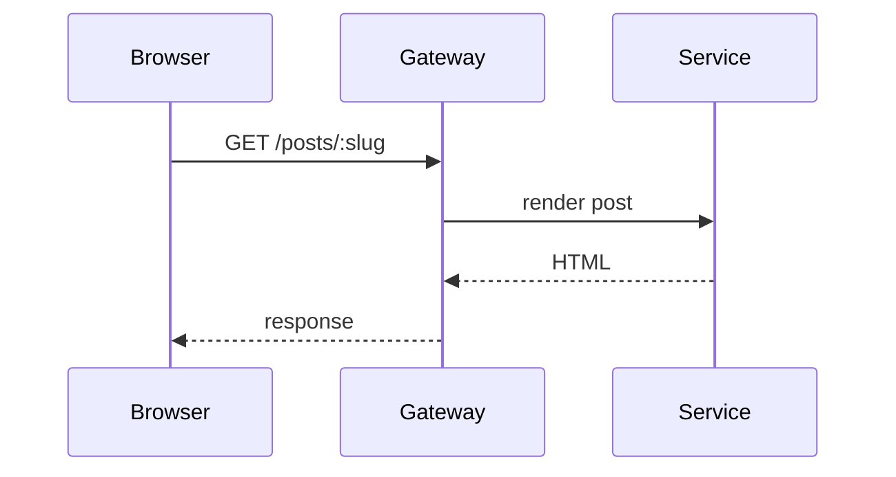

架构图如果只存在于某个设计工具里，很快就会和代码分离。把 Mermaid 图表放进 Markdown，可以让调用链和文章一起参与评审与版本管理。

```mermaid
sequenceDiagram
    participant Browser
    participant Gateway
    participant Service
    Browser->>Gateway: GET /posts/:slug
    Gateway->>Service: render post
    Service-->>Gateway: HTML
    Gateway-->>Browser: response
```

图表不应该代替文字说明。先用文字定义边界，再用图表压缩重复信息，读者才能在异常路径中继续定位问题。
