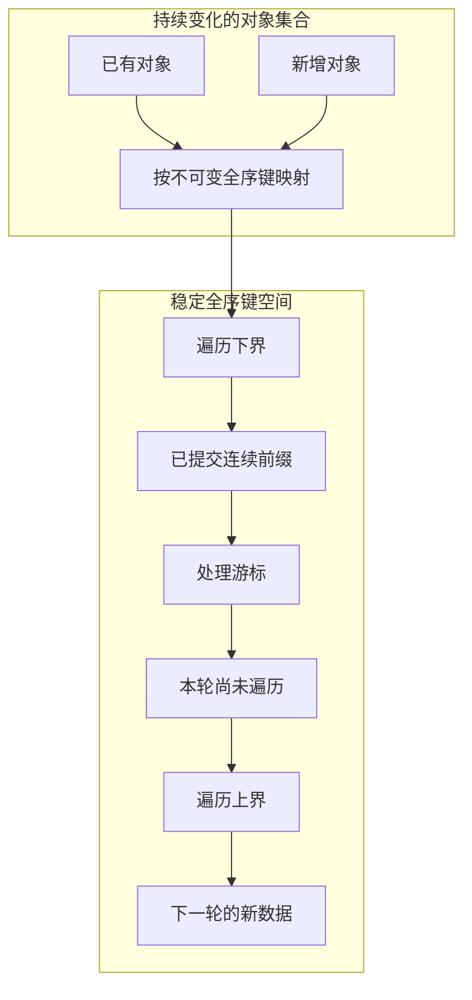
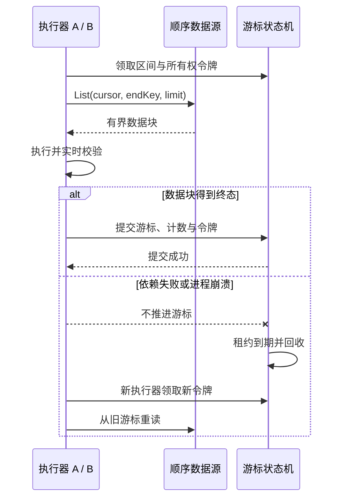

这套东西来自给几亿条 IM 消息做持续分发。任务可能跑几个小时甚至几天，数据还在增加、删除，进程会发布或崩溃，下游也会短暂失败。最容易想到的实现是查出所有目标，然后写一个循环。几千条也许够用，这个量级上循环只是最后一步。

一开始用过 `OFFSET` 分页。第一批处理完，有对象被删了，后面的偏移量前移，边界附近的对象直接被跨过去。反过来，有对象插进前一批，原有对象又会被重复读到。按“当前待处理”筛选也一样：某个对象在游标到达前退出条件，之后又进来，它算本轮还是下一轮说不清。进度百分比也没有可靠分母。

改成按时间排序仍不够。时间可能重复，也可能被回写；多个对象排序值相同，数据库两次查询可以返回不同顺序。游标没法准确表达“最后处理的是哪一个”。

## 按键往前走，不要按页数

后来不再记“第几批”，改记“已经确认处理到哪个键”。每个待遍历对象有一个稳定、唯一、可比较的全序键：本轮期间不能变，任意两个能比出先后，不同对象不能落在同一位置。数据库自增序号、提交时分配的事件序号，或者 `(created_at, id)` 都可能满足。

`(created_at, id)` 有前提：`created_at` 不能被改写，新增记录也不能带着旧时间回填到游标之前。业务保证不了的话，不要直接扫可变业务表，把变化投影到一条只追加的事件日志，用日志序号排顺序。

光有顺序还不够，本轮范围也得钉死。任务创建时记下遍历下界 `startKey`，再读当时已经提交的最大全序键作为 `endKey`。本轮只处理：

```text
startKey < key <= endKey
```

游标一开始等于 `startKey`，只能往 `endKey` 推进。任务开始后的新对象必须拿到更大的键，落到上界之后，留给下一轮。本轮不会因为新数据一直写进来而结束不了。



上界固定的是候选键空间，不是对象内容的快照。对象可能在访问前被删掉，或已经不再满足处理条件。读到之后仍要校验实时状态；不存在或不再适用，记为确定跳过，然后推进游标。批次完成只表示整个键区间都有了处理结论，不表示每个对象都得到了预期业务结果。

事件流里最自然的是用序列号隐式表示全序。任务只保存上界和游标，按 keyset pagination 读有界数据块，内存里最多一块，不随事件总量涨。量小、边界又固定的批处理，也可以创建任务时把有序 ID 放进队列，能直接给出总数。十亿个 ID 全复制到 Redis 就别这么干——创建任务会变成长事务，内存和清理成本跟对象数量线性增长，还没开始遍历控制面先耗尽了。

## 循环其实很短，状态也很少

正常对象不必每个都存一份状态。持久化下来的就是 `startKey`、`endKey`、当前 `cursor`、少量区间租约、完成计数，再加上稀疏的重试和死信。异常量也可能失控的话，要设重试上限和独立归档，别让控制状态悄悄变成另一份全量副本。

```go
for cursor < endKey {
    chunk := List(cursor, endKey, chunkSize)
    result := Process(chunk)

    if result.hasRetryableFailure {
        Backoff()
        continue // 不推进，恢复后仍会读到这个数据块
    }

    cursor = AdvanceAtomically(cursor, chunk.lastKey, result.counters)
}
```

查询同时带 `key > cursor` 和 `key <= endKey`，按完整全序键升序返回。遇到空洞不用补齐，游标记的是最后确认键，不是已处理数量。整个数据块成功，或失败对象已经得到“确定跳过 / 写入死信”等终态，才能原子推进游标。依赖临时失败就不推进。这是至少一次处理：同一数据块可能被执行不止一次。进程如果在副作用完成后、游标提交前退出，最多重放一个有界数据块。计数和游标在同一次原子迁移里更新，避免恢复时进度被加两遍。

## Redis 里只记走到哪，一台不够就切开

Redis 适合保存游标、区间所有权和调度索引，但顺序对不对并不由它决定。说了算的是序列号、遍历上界和已提交游标。

执行器领取区间时拿到所有权令牌和租约，执行期间心跳续租。推进游标的脚本要同时校验旧游标、区间边界和令牌；已经失去所有权的旧执行器即使迟到，也不能覆盖新进度。



全序规定的是先后关系，并不要求只有一个执行器。`(startKey, endKey]` 可以切成有限个互不重叠区间，每个区间自己的游标和租约，不同实例并行跑。区间必须按全序键切，不能按实时 `OFFSET`。键分布不均匀就先抽样或按历史分位点划；热点可以再拆，但两个有效租约不能覆盖同一段。

后段先跑完的时候，全局连续完成游标不能直接跳到最远的那个。只能越过从下界开始连续完成的前缀，后面的区间标记完成并等前面的缺口补齐。区间数是配置出来的有限值，不是一个对象一个分片。

全局并发门限制所有实例对下游的总压力，批次之间轮转，避免一个超长任务占满容量。先拿到全局许可，再领区间——任务还在等槽位时不要报成执行中。通知只是让执行器快点醒来，可能合并或丢失，所以还要低频轮询。叫醒之后只看序列号和持久化游标之间还差哪一段。

令牌能阻止旧执行器迟到改游标，撤销不了它已经做过的数据库更新或外部调用。所以业务侧得有幂等键、条件更新、去重或独占锁。Redis Lua 能保证调度状态原子迁移，不能让 Redis、业务库和第三方自动变成强一致事务，更不能据此说恰好一次。

重试也要分开看。单对象数据异常可以进死信后越过；公共依赖挂了，应该停住当前数据块、退避、保留游标。否则大面积故障会被记成“已完成但全部跳过”。

## 还有几件踩过的

日志如果在落后消费者追上之前被截断，游标再正确也恢复不了。`(cursor, endKey]` 在任务完成前必须还能读。要么阻止清理越过所有活跃任务里最小的已提交游标，要么把批次明确标成不可恢复。

全序键被改写也很麻烦。已经被游标越过的对象如果能把键挪到后面，可能被处理两次；还没走到的对象挪到游标前面，可能永远漏掉。最稳的是一经分配就不能改。新对象如果可能拿到不大于当前上界或游标的键，本轮也看不到它。做不到就扫只追加的变更日志，不要直接扫原表。

进度条也容易骗人。完成计数是已经形成处理终态的对象数，不等于拿到预期业务结果的数量。分页读取和状态查询可以最终一致，但要盯着计数对不对、区间有没有重叠、全局连续完成游标是不是只覆盖连续前缀。
