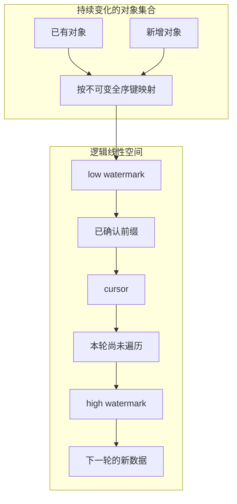
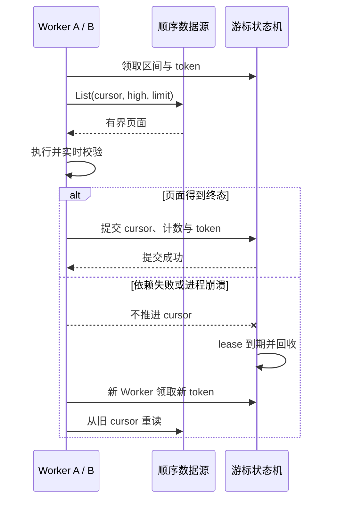

遍历一个持续变化的数据集，最容易想到的实现是查出所有目标，然后写一个循环。这个想法在几千条数据上也许够用，但面对亿级乃至十亿级对象、持续数小时甚至数天的任务，循环只是最后一步。

真正困难的是：数据仍在增加、删除和改变，进程会发布或崩溃，下游会短暂失败，多个批次还会争抢执行容量。系统必须知道自己走到了哪里，重启后从哪里继续，并证明没有因为分页方式而静默漏掉一段数据。

这套设计范式来自对数亿条消息的 IM 事件流进行持续分发。它解决的核心问题是：**先把动态集合变成可以稳定前进的逻辑空间，再讨论调度和恢复。**

## 遍历失败，往往从排序开始

假设任务用 `OFFSET` 翻页。第一页处理完后，有对象被删除，后续对象的偏移量便会前移；继续读取第二页时，排在边界附近的对象可能被直接跨过。反过来，若有对象插入前页，原有对象又可能在下一页重复出现。

动态筛选也会制造同类问题。任务按“当前待处理”查询，某个对象在游标到达前退出条件，之后又重新进入条件，它究竟属于本轮还是下一轮并不明确。持续变化的结果集没有稳定边界，进度百分比也就没有可靠分母。

仅仅改成按时间排序仍不够。时间可能重复，也可能被回写；多个对象拥有相同排序值时，数据库可以在不同查询中返回不同顺序。若排序键不唯一，游标无法准确表达“最后处理的是哪一个”。

因此，超长批次的第一个设计对象不是 worker、队列或 Redis，而是**顺序**。如果不能回答任意两个对象谁在前、谁在后，就无法构造可证明的稳定遍历。

## 本文所说的逻辑线性化

这里的“线性化”不是并发一致性理论中的 linearizability，也不是把十亿个 ID 复制进一条物理 List。它只表示：为所有待遍历对象建立一个稳定、唯一、可比较的逻辑全序。

一个合格的顺序键至少满足三个条件：同一对象的键在本轮遍历期间不可变；任意两个对象的键可以比较；不同对象不会落在同一位置。数据库自增序号、提交时分配的事件序号，或者 `(created_at, id)` 这样的复合键都可能满足条件。

但复合键成立有前提。`created_at` 不能被改写，新增记录也不能带着旧时间回填到游标之前。若业务无法保证这一点，就不应直接遍历可变业务表，而应把对象变化投影到一个追加写事件日志，用日志序号承担顺序契约。

逻辑全序带来一个关键性质：游标不再描述“第几页”，而是描述“已经确认处理到哪个键”。页面大小可以变化，worker 可以重启，只要继续查询大于游标的键，前后关系就不会改变。

## 用两个水位冻结本轮空间

稳定顺序还需要稳定边界。任务创建时记录起点 `low watermark`，并读取当时已经提交的最大顺序键作为 `high watermark`。本轮只遍历下面的半开半闭区间：

```text
low watermark < key <= high watermark
```

`cursor` 初始等于 `low watermark`，随后只能单调向 `high watermark` 推进。任务开始后产生的新对象必须获得更大的键，因此自然落到高水位右侧，留给下一轮处理。本轮不会因为新数据持续写入而永远结束不了。



高水位冻结的是**候选空间**，不是对象内容的历史快照。对象可能在访问前被删除，或已经不再满足处理条件。worker 读取对象后仍需校验实时状态；不存在或不再适用时，将其记为确定跳过，然后推进游标。

这一区分很重要。批次完成只表示整个键区间都得到了处理结论，不表示所有对象都得到了预期的业务结果，更不表示执行期间业务数据没有变化。

## 两种顺序空间，两个适用尺度

在事件流里，最自然的实现是隐式 sequence 空间。每个已提交事件拥有单调序号，任务只保存高水位和游标，通过 keyset 查询不断读取有界页面。内存中最多存在一页对象，不随事件总量增长。

这正适合亿级或十亿级遍历。十亿只是设计规模，不是单机吞吐承诺。处理时间取决于页面大小、并发度、单项成本和下游容量，但控制面状态始终只与活跃批次、并行区间和少量异常有关。

另一种实现是显式物化目标快照：创建任务时取得有序 ID 集合，将它们放入待处理队列，再逐个领取。这对目标较少、边界固定的批处理非常实用，因为它能直接给出总数，也方便展示逐项进度。

然而，显式队列是逻辑线性化的一种适配，不是超大规模方案本身。若把十亿个 ID 全部复制到 Redis，不仅创建任务本身会变成长事务，内存、网络和清理成本也会与对象数量线性增长，系统还没开始遍历就先耗尽了控制面资源。

## 用有界状态描述十亿级任务

超大批次不应为每个正常对象保存一份状态。一个遍历任务的核心持久化信息可以收敛为：`lowWatermark`、`highWatermark`、当前 `cursor`、少量区间 lease、完成计数，以及稀疏的 retry 和 dead-letter 记录。

正常路径只推进游标和计数。只有暂时失败、重试耗尽或需要人工分析的对象才进入稀疏异常集合。如果异常量也可能失控，就要设置重试上限、告警阈值和独立归档，而不能让控制状态悄悄退化成另一份全量副本。

核心循环可以压缩成很短的伪代码：

```go
for cursor < highWatermark {
    page := List(cursor, highWatermark, pageSize)
    result := Process(page)

    if result.hasRetryableFailure {
        Backoff()
        continue // 不推进，恢复后仍会读到这一页
    }

    cursor = AdvanceAtomically(cursor, page.lastKey, result.counters)
}
```

查询必须同时带上 `key > cursor` 和 `key <= highWatermark`，并按完整全序键升序返回。遇到顺序键空洞不需要补齐；游标记录的是最后确认键，而不是已处理数量。

只有整页成功，或其中失败对象已经得到“确定跳过、进入 dead-letter”等终态，才能原子推进游标。依赖临时失败时不推进，下一次循环或新 worker 会重新读取同一页，因此系统提供的是至少一次语义。

页面应保持有界。这样，即使进程在业务副作用完成后、游标提交前退出，最多重放一个有界页面，而不是重新扫描整个批次。计数与游标在同一个原子状态迁移中更新，可以避免恢复时重复累计进度。

## 有顺序，不等于只能串行

逻辑线性化规定的是确定的前后关系，并不要求只有一个 worker。创建任务后，可以把 `(low, high]` 切成有限个互不重叠区间，每个区间维护自己的 cursor 和 lease，由不同实例并行遍历。

区间必须由顺序键边界定义，而不是由实时 `OFFSET` 定义。对于分布不均匀的键空间，可以先按索引抽样或按历史分位点划分；热点区间还可以继续拆分，但任何时刻都不能让两个有效 lease 覆盖同一范围。

并行会引入“后段先完成”的情况。此时整体完成水位不能直接跳到最远 cursor，而只能越过从 low 开始连续完成的前缀。后面的区间可以标记完成并等待，直到前面的缺口被补齐。

因此，控制状态与对象规模无关，却会与并行区间数有关。区间数应该是受配置约束的有限值，而不是为每个对象创建一个分片。公平调度也在区间或批次之间轮转，不需要先物化全部目标。

## Redis 状态机属于恢复层

Redis 很适合保存游标、区间所有权和调度索引，但它是线性遍历之上的恢复层，不是遍历正确性的来源。真正定义事实的是稳定 sequence、高水位和已提交 cursor。

worker 领取区间时获得 claim token 和有期限的 lease，执行期间通过心跳续租。游标推进脚本必须同时校验旧 cursor、区间边界和 token；已经失去所有权的旧 worker 即使迟到，也不能覆盖新 worker 的进度。



全局并发门限制所有实例对下游的总压力；批次轮转避免一个超长任务长期占满容量。领取顺序应是先取得全局许可，再领取区间或页面，避免任务还在等待执行槽位时就被误报为执行中。

通知只负责让 worker 更快醒来，不能成为唯一事实来源。通知可能合并或丢失，因此仍需低频轮询兜底。无论由通知还是定时器触发，worker 都只相信 sequence 与持久化 cursor 之间尚未处理的差值。

## 恢复解决不了业务副作用

token 能阻止失去租约的 worker 迟到推进游标，却无法撤销它已经完成的数据库更新或外部调用。进程可能在副作用成功后、提交 cursor 前退出，新 worker 随后会再次执行同一对象。

所以至少一次遍历要求业务执行器具备幂等键、条件更新、去重记录或独占锁。Redis Lua 可以保证调度状态原子迁移，但不能让 Redis、业务数据库和第三方系统自动形成强一致事务，更不能据此声称恰好一次执行。

重试也应区分对象失败与依赖失败。单对象数据异常可以写入稀疏 dead-letter 后越过；公共依赖不可用时则应停止当前页面、退避并保留 cursor。否则，大面积故障会被错误地转换成“已完成但全部跳过”。

## 四条必须写进契约的边界

第一条是 retention。数据源必须保证 `(cursor, high]` 在任务完成前仍可读取。若日志在落后消费者追上之前被截断，游标再正确也无法恢复。系统要么阻止清理越过最慢水位，要么将批次明确终结为不可恢复。

第二条是排序键回写。已经被游标越过的对象若能修改排序键并移动到后方，就可能被重复处理；未到达对象若移动到游标之前，就可能永久遗漏。最稳妥的规则是顺序键一经分配不可修改。

第三条是游标前插入。新对象若可能获得不大于当前高水位或游标的键，本轮就可能看不到它。顺序分配必须与提交顺序建立契约；做不到时，应遍历追加写变更日志，而不是直接遍历原表。

第四条是进度含义。完成计数描述已经形成处理终态的对象数，不等于获得预期业务结果的数量。分页读取和状态查询可以最终一致，但要持续校验计数不变量、区间不重叠，以及整体完成水位只覆盖连续前缀。

## 先设计直线，再设计车流

超长批次的核心不是把队列做得更复杂，而是先回答三个问题：对象按什么稳定顺序排列，本轮在哪个高水位结束，哪个游标代表已经确认的连续前缀。

有了这条逻辑直线，内存只需容纳有界页面，持久化状态只需覆盖游标、有限区间和稀疏异常。并行、全局限流、公平调度、租约、心跳和 Redis 原子脚本都有了明确位置：它们负责让遍历跑得快、跑得稳、能够接管，却不替代顺序本身。

对于较小的固定批次，可以把这条直线显式物化成 ID 队列；对于亿级消息和十亿级对象，则应让 sequence 隐式表达它。实现形态可以不同，但可恢复遍历的根基始终相同：**稳定全序、固定边界、游标只向前。**
